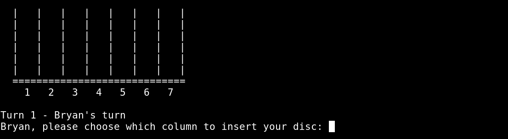
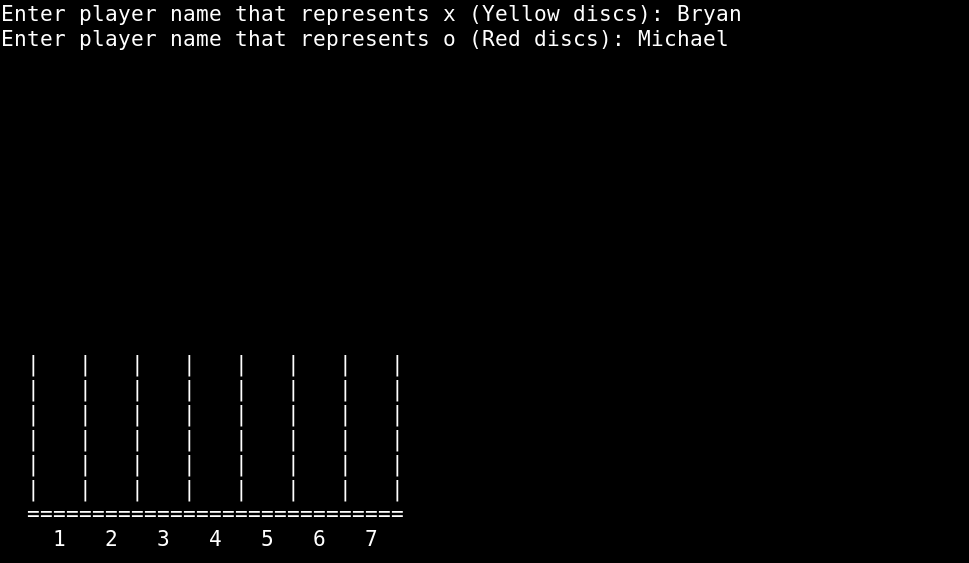
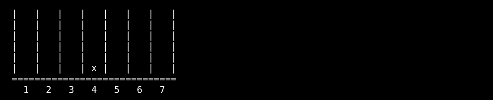
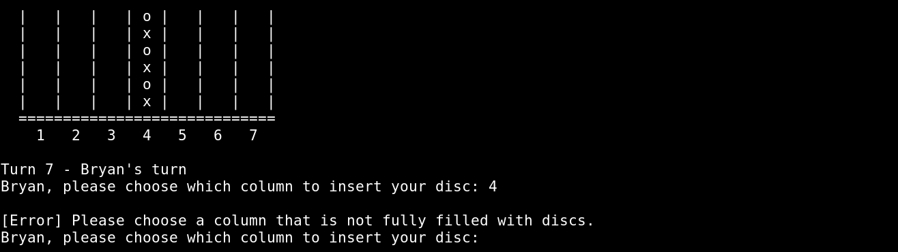
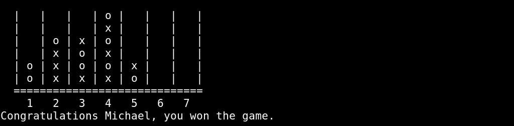

# Connect Four

Connect Four, a connection game for 2 players, played on a seven-column, six-row vertically suspended grid. Players take turns dropping discs, occupying the lowest available space within the column, with the objective to form a horizontal, vertical, or diagonal line of four of one's own discs.

&nbsp;
## Task - Implement the game logic

### A.1 Start Condition - Gather player inputs and implement the board.

&nbsp;
### A.2 Managing turns - Player that represents the yellow disc starts the game.
#### A.2.1 Asking the player where s/he wants to insert s/he disc

&nbsp;
#### A.2.2 Discs Insertion

&nbsp;
#### A.2.3 Error Handling

&nbsp;
### A.3 Printing Final Results
